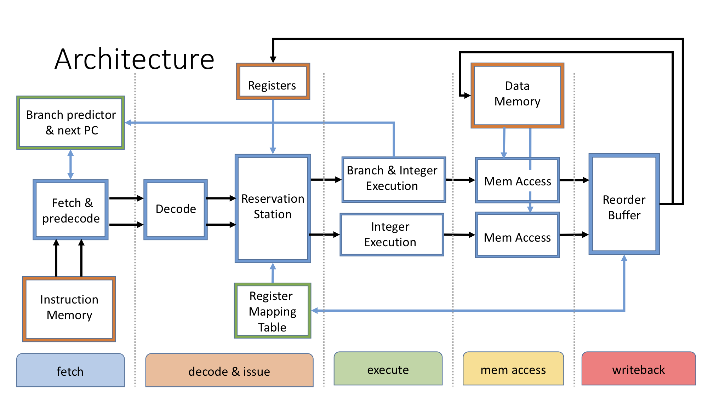

# Simulating Advanced Processors

This Java program simulates some functionalities of complex processor architectures. The project was part of the course **Advanced Computer Architecture** at the University of Bristol in the fall of 2016. In order to understand how modern processors achieve low CPI (cycles per instruction), I designed a whole new computer architecture from scratch. It speculatively processes MIPS-like instructions in parallel pipelines.

This final version implements 2-way superscalar, out-of-order execution of instructions with a dynamic branch prediction scheme. A GUI allows to step through the execution of a program cycle-by-cycle to inspect the contents of the registers, pipeline stages, etc.

The 5-stage pipelines are configured as follows:




## Getting Started

These instructions will get you a copy of the project up and running on your local machine.

### Prerequisites

To run `javac` from the command line you'll need to have the [Java SDK](https://www.oracle.com/technetwork/java/javase/downloads/index.html) installed.

Secondly, to compile the java source code, we'll use [ant](https://ant.apache.org). macOS users can

```
brew install ant
```

verify that it works using `ant -v`. The output should look like this:

```
Apache Ant(TM) version 1.10.5 compiled on July 10 2018
Trying the default build file: build.xml
Buildfile: build.xml does not exist!
Build failed
```

### Installing

Here's how to compile the code.
Move to the directory containing the `build.xml` file

```
cd superscalar_processor_OoO
```

and compile 

```
ant
```

Verify that the `bin` directory now contains 3 folders with compiled Java code in `.class` format, in addition to the `programs` folder containing the benchmark programs.

## Running the simulator


### Benchmarks

Four benchmark programs are included:

1. A recursive algorithm that calculates the greatest common divisor (GCD) of two numbers.
2. Bubblesort
3. Vector addition
4. Dotproduct of two 10-dimensional vectors

Note that these MIPS-like programs were compiled by hand. Depending on the processor's configuration, NOP instructions have to be inserted to ensure correct execution.

To start the GUI, simply

```
cd bin
```

and, to load the GCD program for example,

```
java benchmarks.GCD true
```

The first argument selects the benchmark program. Valid options are `GCD`, `BubbleSort`, `VectorAddition` or `DotProduct`.
The second argument enables the branch predictor. It can be either `true` or `false`.

This will open four windows (initially empty):

- **Registers**
- **Data Memory**
- **Instruction Memory**
- **Controls**


Click the *step* button in the **Controls** window to advance the program by one cycle. 
Click *execute all* to run the program until it's finished.
Each cycle, the simulator prints detailed status info & results to `stdout`.
Close any window to terminate.


## Authors

* **Julien Schuermans** - [julienschuermans](https://github.com/julienschuermans)

## Acknowledgments

* Many thanks to David May & Simon McIntosh-Smith from the University of Bristol for their guidance and feedback.
* During this project I relied heavily on *Computer Architecture - A Quantitative Approach, Hennessy & Patterson*

